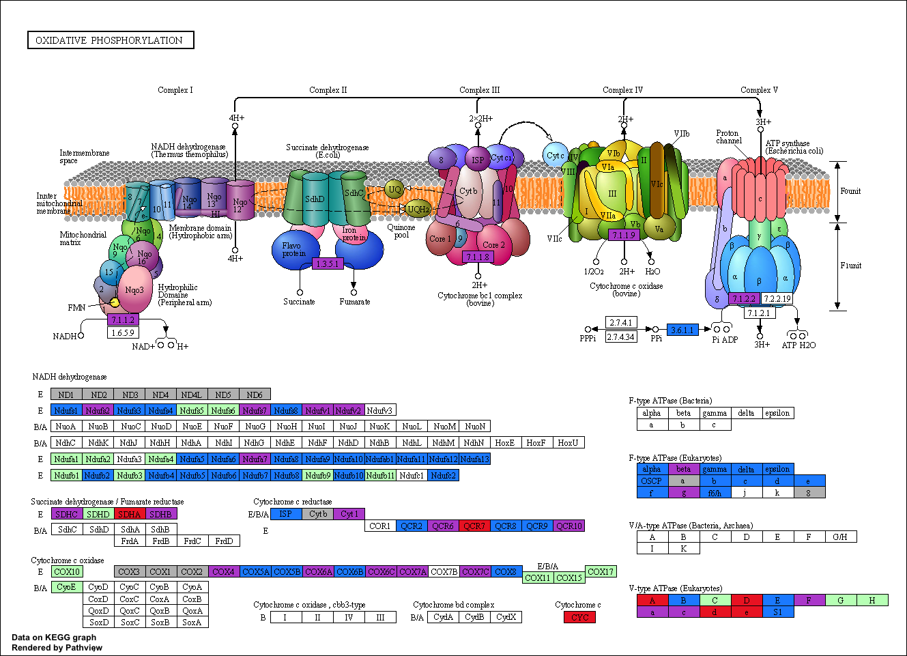

```{r setup, include=FALSE}
knitr::opts_chunk$set(echo = FALSE)
```

```{r, message=FALSE, warning=FALSE}

list.of.packages <- c("edgeR", "KEGGREST","gplots","pathview","visNetwork","goseq","RcisTarget","dplyr")
new.packages <- list.of.packages[!(list.of.packages %in% installed.packages()[,"Package"])]
if(length(new.packages)){
  if (!require("BiocManager", quietly = TRUE)){
    install.packages("BiocManager")
    }  
  BiocManager::install("KEGGREST")
  BiocManager::install("pathview")
}

library(pathview)
library(KEGGREST)

##ID conversion table
convert=read.csv("https://raw.githubusercontent.com/DavidRandLab/Santiago-et-al-2021-BMC-Genomics/main/Data%20Files/FBgnConversionTable.csv",row.names=1)

kegg=read.csv("https://raw.githubusercontent.com/DavidRandLab/Santiago-et-al-2021-BMC-Genomics/main/Data%20Files/FBgn2KEGG.csv")

clusterdata=read.csv("https://raw.githubusercontent.com/DavidRandLab/Santiago-et-al-2021-BMC-Genomics/main/Data%20Files/MBcluster.seq%20Output.csv",row.names=1)

##ImpulseDE2 output tables
oocsoc=read.csv("https://raw.githubusercontent.com/DavidRandLab/Santiago-et-al-2021-BMC-Genomics/main/Data%20Files/ImpulseDE%20Outputs/Table%20S3G%20OOC-SOC.csv",row.names=1)
oorsor=read.csv("https://raw.githubusercontent.com/DavidRandLab/Santiago-et-al-2021-BMC-Genomics/main/Data%20Files/ImpulseDE%20Outputs/Table%20S3H%20OOR-SOR.csv",row.names=1)

##ImpulseDE2 output tables with significant genes only
OCSC=na.omit(oocsoc[oocsoc$padj<.05,])
ORSR=na.omit(oorsor[oorsor$padj<.05,])

c1=intersect(row.names(clusterdata[clusterdata[,17]==1,]),c(row.names(OCSC),row.names(ORSR)))
c1=setdiff(c1,row.names(convert[convert$mt==1,]))
c5=intersect(row.names(clusterdata[clusterdata[,17]==5,]),c(row.names(OCSC),row.names(ORSR)))
c5=setdiff(c5,row.names(convert[convert$mt==1,]))

OXPHOS=(kegg[grep("00190",kegg[,2]),1])
OXPHOS.MT=gsub("dme:","",convert[intersect(OXPHOS,convert[convert[,"mt"]==1,1]),"KEGG.ID"])
OXPHOS.C1=gsub("dme:","",convert[intersect(c1,OXPHOS),"KEGG.ID"])
OXPHOS.C5=gsub("dme:","",convert[intersect(c5,OXPHOS),"KEGG.ID"])

temp=matrix(keggGet("dme00190")[[1]]$GENE,nrow=2)
temp2=strsplit(temp[2,],split="KO:")
i=1
while(i<=length(temp2)){
  names(temp2)[i]=temp2[[i]][2]
  i=i+1
}
temp2=names(temp2)
temp2=substring(temp2,1,6)
names(temp2)=temp[1,]
##this is the same spot on the kegg map but it has 2 different names for the subunits
temp2["Dmel_CG7007"]="K02155"
temp3=names(temp2)
names(temp3)=temp2


##OXPHOS.C1=gsub("dme:","",convert[OXPHOS.C1,"KEGG.ID"])
OXPHOS.C1=temp2[OXPHOS.C1]
OXPHOS.C5=temp2[OXPHOS.C5]
OXPHOS.C1C5=intersect(OXPHOS.C1,OXPHOS.C5)
OXPHOS.C1=names(OXPHOS.C1)
OXPHOS.C5=names(OXPHOS.C5)
OXPHOS.C1C5=as.vector(temp3[OXPHOS.C1C5])

download.kegg(pathway.id="00190",species="dme")
xml.file="dme00190.xml"
node.data=node.info(xml.file)

plot.data.gene=node.map(mol.data=OXPHOS.MT, node.data, node.types="gene")
cols.ts.gene=node.color(plot.data.gene, limit=2, bins=2)
cols.ts.gene[cols.ts.gene!="#FFFFFF"]="grey"

plot.data.gene=node.map(mol.data=OXPHOS.C1, node.data, node.types="gene")
cols.ts.gene.C1=node.color(plot.data.gene, limit=2, bins=2)
cols.ts.gene[cols.ts.gene.C1!="#FFFFFF"]="firebrick2"

plot.data.gene=node.map(mol.data=OXPHOS.C5, node.data, node.types="gene")
cols.ts.gene.C5=node.color(plot.data.gene, limit=2, bins=2)
cols.ts.gene[cols.ts.gene.C5!="#FFFFFF"]="dodgerblue"

plot.data.gene=node.map(mol.data=OXPHOS.C1C5, node.data, node.types="gene")
cols.ts.gene.C1C5=node.color(plot.data.gene, limit=2, bins=2)
cols.ts.gene[cols.ts.gene.C1C5!="#FFFFFF"]="mediumorchid"

cols.ts.gene[cols.ts.gene=="#FFFFFF"]="darkseagreen1"

plot.data.gene=node.map(mol.data=c(OXPHOS.C1,OXPHOS.C5,OXPHOS.C1C5), node.data, node.types="gene")

pv.pars= keggview.native(plot.data.gene=plot.data.gene,
                         cols.ts.gene=cols.ts.gene, node.data=node.data,
                         pathway.name="dme00190",
                         same.layer=T, plot.col.key=F, out.suffix = "OXPHOS.KEGG.GeneClusters")

```


<br  /><br  /><br  />
***Figure 4***<br  />
OXPHOS KEGG pathway mapping DEGs<br  />
```{r, out.width = "1400px"}

```
